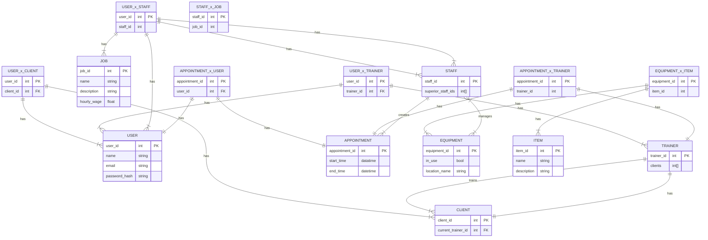

## This is the planning document for the GymSync application, which is being created for a Capstone course.

## E-R Diagrams

```mermaid
erDiagram

USER{
  user_id int PK
  name string
  email string
  password_hash string
}

TRAINER{
  trainer_id int PK
  clients int[]
}

STAFF{
  staff_id int PK
  superior_staff_ids int[]
}

CLIENT{
  client_id int PK
  current_trainer_id int FK  
}

JOB{
  job_id int PK
  name string
  description string
  hourly_wage float
}

APPOINTMENT{
  appointment_id int PK
  start_time datatime
  end_time datetime
}

USER_x_CLIENT{
  user_id int PK
  client_id int FK
}

USER_x_TRAINER{
  user_id int PK
  trainer_id int FK
}

USER_x_STAFF{
  user_id int PK
  staff_id int
}

STAFF_x_JOB{
  staff_id int PK
  job_id int
}

APPOINTMENT_x_USER{
  appointment_id int PK
  user_id int FK
}

APPOINTMENT_x_TRAINER{
  appointment_id int PK
  trainer_id int
}

EQUIPMENT{
  equipment_id int PK
  in_use bool
  location_name string
}

ITEM{
  item_id int PK
  name string
  description string
}

EQUIPMENT_x_ITEM{
  equipment_id int PK
  item_id int
}

USER_x_CLIENT ||--|{ USER : has
USER_x_CLIENT ||--|{ CLIENT : has

USER_x_TRAINER ||--|{ USER : has
USER_x_TRAINER ||--|{ TRAINER : has

USER_x_STAFF ||--|{ USER : has
USER_x_STAFF ||--|{ STAFF : has

USER_x_STAFF ||--|{ STAFF : has
USER_x_STAFF ||--|{ JOB : has

EQUIPMENT_x_ITEM ||--|{ EQUIPMENT : has
EQUIPMENT_x_ITEM ||--|{ ITEM : has

APPOINTMENT_x_USER ||--|| USER : has
APPOINTMENT_x_USER ||--|| APPOINTMENT : has

APPOINTMENT_x_TRAINER ||--|| TRAINER : has
APPOINTMENT_x_TRAINER ||--|| APPOINTMENT : has

TRAINER ||--|{ CLIENT : trains
CLIENT ||--|| TRAINER : has

STAFF ||--|{ APPOINTMENT : creates
STAFF }|--|{ EQUIPMENT : manages

```
